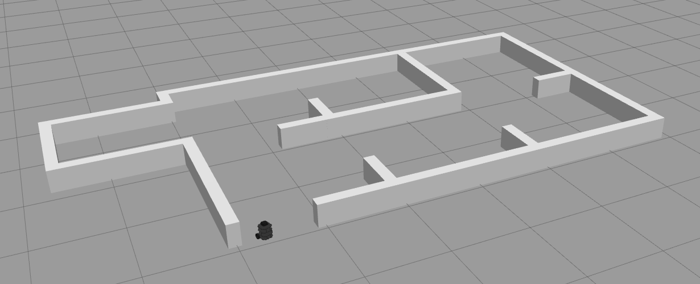
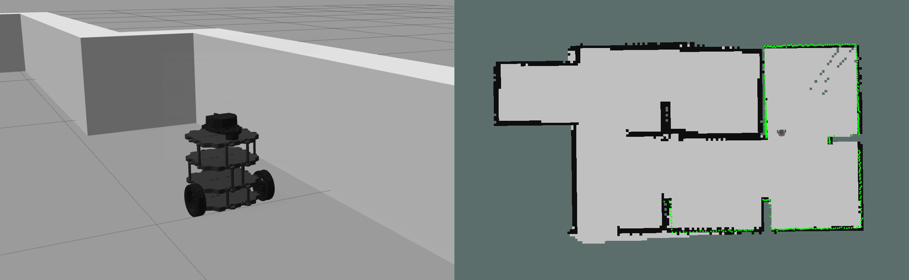

# TurtleBot Maze Solver

TurtleBot Maze Solver is a TurtleBot3 designed to solve mazes using its Simultaneous Localisation and Mapping (SLAM) modules: Laser Distance Sensor (LDS) and Inertial Measurement Unit (IMU) for odometry data. It features a wall-following algorithm, simulation environment, and trajectory visualiser. This project is written in C++, with the Robot Operating System (ROS) framework (roscpp), and offers a solution for autonomously navigating through mazes. A PD controller is utilised to smooth the movement of the bot and ensure it follows the wall without straying, especially when encountering corners or executing turns.



https://github.com/sunghenry/turtlebot-maze-solver/assets/164011196/59004988-39d2-441d-869b-e574ba0fae3c


## Getting Started

This guide outlines the steps to run the TurtleBot Maze Solver with simulation on Ubuntu 20.04 with ROS Noetic. For other platforms, please refer to additional resources.

### Setup

#### Setup ROS Environment

- **Desktop-Full Install ROS Noetic**: Follow the instructions on the [ROS Wiki](http://wiki.ros.org/noetic/Installation/Ubuntu) for installing ROS Noetic on  your Ubuntu system.

#### Configure Environment Variables

1. **Update `~/.bash_profile`**:

- Append the following lines to the end of the `~/.bash_profile` configuration file:
  ```
  source /opt/ros/noetic/setup.bash
  source ~/catkin_ws/devel/setup.bash
  export TURTLEBOT3_MODEL=burger
  export GAZEBO_MODEL_PATH=$GAZEBO_MODEL_PATH:~/catkin_ws/src/maze_solver_bot/models
  ```

2. **Update `~/.bashrc`** :

- Append the following lines to the end of the `~/.bashrc` configuration file to source the `~/.bash_profile`:
  ```
  if [ -f ~/.bash_profile ]; then
    . ~/.bash_profile
  fi
  ```

#### Install Additional Packages

1. **Install xterm**: Execute the following command to install xterm, which is used to execute modules in the `run.sh` script:
  ```
  sudo apt install xterm
  ```

2. Install `slam_gmapping`: Execute the following command to install the `slam_gmapping` package, which is not included in the base ROS installation:
  ```
  sudo apt install ros-noetic-slam-gmapping
  ```

#### Set Up Workspace and Dependencies

1. **Create a Workspace**: Create a workspace `~/catkin_ws/src/` and place the repository files there.
2. **Extract Dependencies**: Extract the dependencies from `packages.zip` and place them in `~/catkin_ws/src/`. The dependencies include:

- `turtlebot3_bringup`, `turtlebot3_description`, `turtlebot3_slam` - TurtleBot3 configuration and simulation ([TurtleBot3 Repository](https://github.com/ROBOTIS-GIT/turtlebot3))
- `turtlebot3_msgs` - Dependency for TurtleBot3 packages ([Repository](https://github.com/ROBOTIS-GIT/turtlebot3_msgs))
- `gazebo2rviz`, `pysdf` - Model visualiser and its dependency ([Repository](https://github.com/andreasBihlmaier/gazebo2rviz), [pysdf Repository](https://github.com/andreasBihlmaier/pysdf))
- `hector_map_tools`, `hector_nav_msgs`, `hector_trajectory_server` - Trajectory visualiser ([hector_slam Repository](https://github.com/tu-darmstadt-ros-pkg/hector_slam))

#### Configure Gazebo Models

- **Place Model Files**: Place the model files  `model.config` and `model.sdf` in `~/.gazebo/models/`. You can find premade files in the repository under `/models`.

#### Build Workspace

- **Build Workspace**: Execute the command `catkin_make` in `~/catkin_ws/` to build the workspace.

### Execution

0. **Fast Execution**: Executes all of the steps below with no timing control; make sure to place and run the file `run.sh` in `~/catkin_ws/` or any of its parent directories.
  ```
  ./run.sh
  ```

1. **ROS**: Redundant step since `roslaunch` automatically boots up ROS, but is a good ritual.
  ```
  roscore
  ```

2. **Simulation Environment**: Launches the simulation environment in Gazebo with the maze model and the TurtleBot.
  ```
  roslaunch maze_solver_bot maze_world.launch
  ```

3. **Visualisation Renderer**: Launches the Gazebo model to RViz visualisation renderer.
  ```
  roslaunch gazebo2rviz gazebo2rviz.launch
  ```

4. **Environment Visualiser**: Opens RViz with configured settings for visualising the environment.
  ```
  rosrun rviz rviz -d `rospack find maze_solver_bot`/rviz/visualiser.rviz
  ```

5. **SLAM**: Launches the SLAM mapping node for mapping the environment. This also launches another RViz window for SLAM visualisation.
  ```
  roslaunch turtlebot3_slam turtlebot3_slam.launch
  ```

6. **Trajectory Visualiser**: Launches the trajectory visualiser for visualising the TurtleBot's trajectory in the environment.
  ```
  roslaunch maze_solver_bot trajectory.launch
  ```

7. **Maze Solver**: Launches the maze solver node for controlling the TurtleBot to navigate through the maze autonomously.
  ```
  roslaunch maze_solver_bot maze_solver_bot.launch
  ```

### Configuration

- Parameters such as default velocities, controller values, operation thresholds, scan angles and more can be tuned in `/config/param.yml`.
- Custom models can be placed in `/models`, or can set your own custom path by changing the environment variable `GAZEBO_MODEL_PATH` in `~/.bash_profile`. Choose the model to load by replacing the following lines (22) with your desired model (file) name in `/worlds/maze.world`:
  ```
  <!-- maze -->
  <include>
    <uri>model://enclosed</uri>
  </include>
  ```
- Starting position for the bot can be specified in `/launch/maze_world.launch`. Note that the bot can be placed in its desired starting position (and can be moved any time) using the Gazebo GUI as well.
